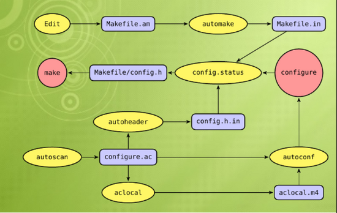

## CMake

## Overview

**CMake** is cross-platform free and open-source software for managing the build process of software using a compiler-independent method. It is designed to support directory hierarchies and applications that depend on multiple libraries. It is used in conjunction with native build environments such as make, Apple's Xcode, and Microsoft Visual Studio. It has minimal dependencies, requiring only a C++ compiler on its own build system.


## Features

- Manage complex, large build environments
- Flexible and extensible
    * Support macros
    * Modules for finding/configuring software
    * Extend for new platforms and languages
    * Create custom targets/commands
    * Run external programs
- Simple, intuitive syntax
- Support regular expression
- Support "In-Source" and "Out-of-Source" builds
- Support cross compiling
- Integrated testing and packaging (CTest, CPack)


## Build Process


The build process with CMake takes place in two stages. First, standard build files are created from configuration files. Then the platform's native build tools are used for the actual building.


Each build project contains a CMakeLists.txt file in every directory that controls the build process. The CMakeLists.txt file has one or more commands in the form COMMAND (args...), with COMMAND representing the name of each command and args the list of arguments, each separated by white space. While there are many built-in rules for compiling the software libraries (static and dynamic) and executables, there are also provisions for custom build rules. Some build dependencies can be determined automatically. Advanced users can also create and incorporate additional makefile generators to support their specific compiler and OS needs.


> http://www.aosabook.org/en/cmake.html


## CMake vs GNU `autotools`




> http://www.tuicool.com/articles/nuqmee

## Other Build System

- GNU `make`
- GNU `autotools`
- Rake
- Maven
- Ant
- QMake

> https://bengarney.com/2012/08/26/some-thoughts-on-build-systems/

> https://www.sitepoint.com/comparison-build-systems/

## Example

```
cmake_minimum_required (VERSION 2.8)
project (mraa)

FIND_PACKAGE (Threads REQUIRED)

set (CMAKE_CXX_FLAGS_DEBUG "${CMAKE_CXX_FLAGS_DEBUG} -Wall -fno-omit-frame-pointer")
set (CMAKE_CXX_FLAGS_RELEASE "${CMAKE_CXX_FLAGS_RELEASE} -Wall")
set (LIB_INSTALL_DIR "lib${LIB_SUFFIX}" CACHE PATH "Installation path for libraries")

# Set CMAKE_LIB_INSTALL_DIR if not defined
include(GNUInstallDirs)

# Appends the cmake/modules path to MAKE_MODULE_PATH variable.
set (CMAKE_MODULE_PATH ${CMAKE_CURRENT_SOURCE_DIR}/cmake/modules ${CMAKE_MODULE_PATH})

# Make a version file containing the current version from git.
set (VERSION "v0.8.0")

message (INFO " - libmraa Version ${VERSION}")

#parse the version information into pieces.
string (REGEX REPLACE "^v([0-9]+)\\..*" "\\1" VERSION_MAJOR "${VERSION}")
string (REGEX REPLACE "^v[0-9]+\\.([0-9]+).*" "\\1" VERSION_MINOR "${VERSION}")
string (REGEX REPLACE "^v[0-9]+\\.[0-9]+\\.([0-9]+).*" "\\1" VERSION_PATCH "${VERSION}")
string (REGEX REPLACE "^v[0-9]+\\.[0-9]+\\.[0-9]+\\-([0-9]+).*" "\\1" VERSION_COMMIT "${VERSION}")
string (REGEX REPLACE "^v[0-9]+\\.[0-9]+\\.[0-9]+-[0-9]+\\-(.*)" "\\1" VERSION_SHA1 "${VERSION}")
set (VERSION_SHORT "${VERSION_MAJOR}.${VERSION_MINOR}.${VERSION_PATCH}")

if ("${VERSION_COMMIT}" MATCHES "^v.*")
  set (VERSION_COMMIT "")
endif()

configure_file (${CMAKE_CURRENT_SOURCE_DIR}/cmake/modules/version.c.in
                ${CMAKE_CURRENT_BINARY_DIR}/src/version.c)

# this is the library version, independant of git revision
set (mraa_VERSION_MAJOR ${VERSION_MAJOR})
set (mraa_VERSION_MINOR ${VERSION_MINOR})
set (mraa_VERSION_PATCH ${VERSION_PATCH})
set (mraa_VERSION_STRING ${mraa_VERSION_MAJOR}.${mraa_VERSION_MINOR}.${mraa_VERSION_PATCH})

set (CMAKE_SWIG_FLAGS "")

find_path (SYSTEM_USR_DIR "stdlib.h")
include_directories (${SYSTEM_USR_DIR})

option (BUILDDOC "Build all doc." OFF)
option (BUILDSWIG "Build swig modules." OFF)
option (BUILDSWIGPYTHON "Build swig python modules." OFF)
option (BUILDSWIGNODE "Build swig node modules." OFF)
option (BUILDSWIGJAVA "Build Java API." OFF)
option (USBPLAT "Detection USB platform." OFF)
option (FTDI4222 "Build with FTDI FT4222 subplatform support." OFF)
option (IPK "Generate IPK using CPack" OFF)
option (RPM "Generate RPM using CPack" OFF)
option (BUILDPYTHON3 "Use python3 for building/installing" OFF)
option (ENABLEEXAMPLES "Disable building of examples" ON)
option (INSTALLGPIOTOOL "Install gpio tool" OFF)
option (BUILDARCH "Override architecture to build for - override" OFF)
option (TESTS "Override the addition of tests" ON)

if (NOT BUILDSWIG)
  set (BUILDSWIGPYTHON OFF)
  set (BUILDSWIGNODE OFF)
  set (BUILDSWIGJAVA OFF)
endif()

if (NOT BUILDARCH)
  include (TargetArch)
  target_architecture (DETECTED_ARCH)
  message( INFO " - Target arch is ${DETECTED_ARCH}")
else ()
  set (DETECTED_ARCH ${BUILDARCH})
  message( INFO " - Override arch is ${DETECTED_ARCH}")
endif()

if (DETECTED_ARCH STREQUAL "i586" OR DETECTED_ARCH STREQUAL "x86_64"
    OR DETECTED_ARCH STREQUAL "i386")
  set (X86PLAT ON)
elseif (DETECTED_ARCH MATCHES "arm.*")
  set (ARMPLAT ON)
elseif (DETECTED_ARCH MATCHES "mips")
  set (MIPSPLAT ON)
else ()
  message(FATAL_ERROR "Only x86, arm and mips platforms currently supported")
endif()

if (BUILDSWIGPYTHON)
  if (BUILDPYTHON3)
    set (PYTHONBUILD_VERSION 3)
  else ()
    set (PYTHONBUILD_VERSION 2.7)
  endif ()
  find_package (PythonInterp ${PYTHONBUILD_VERSION} REQUIRED)
  if (TESTS)
    if (${PYTHONINTERP_FOUND})
      enable_testing ()
      add_subdirectory (tests)
    endif ()
  endif ()
endif ()

if (BUILDDOC)
  # add a target to generate API documentation with Doxygen
  find_package (Doxygen)
  if (DOXYGEN_FOUND)
    configure_file (${CMAKE_CURRENT_SOURCE_DIR}/Doxyfile.in ${CMAKE_CURRENT_BINARY_DIR}/Doxyfile @ONLY)
    if (BUILDSWIGJAVA)
      configure_file (${CMAKE_CURRENT_SOURCE_DIR}/Doxyfile.java.in ${CMAKE_CURRENT_BINARY_DIR}/src/java/Doxyfile @ONLY)
    endif ()
    add_custom_target (doc
      ${DOXYGEN_EXECUTABLE} ${CMAKE_CURRENT_BINARY_DIR}/Doxyfile
      WORKING_DIRECTORY ${CMAKE_CURRENT_BINARY_DIR}
      COMMENT "Generating API documentation with Doxygen" VERBATIM
    )
  endif (DOXYGEN_FOUND)
endif ()

if (IPK)
  # Get target package arch from Yocto ADT sysroot if set or host OS, mapping to Ubuntu name if necessary
  if (DEFINED ENV{OECORE_TARGET_SYSROOT})
    GET_FILENAME_COMPONENT (DETECTED_SYSROOT $ENV{OECORE_TARGET_SYSROOT} NAME)
    string (REGEX REPLACE "-poky-linux" "" TARGET_ARCH "${DETECTED_SYSROOT}")
  else ()
    # debian uses amd64 to denote x86_64
    if (DETECTED_ARCH STREQUAL "x86_64")
      set (TARGET_ARCH "amd64")
    else ()
      set (TARGET_ARCH ${DETECTED_ARCH})
    endif ()
  endif ()
  message (INFO " - Package arch is ${TARGET_ARCH}")

  set(CPACK_GENERATOR "DEB" "TGZ")
  set(OPKG_ARCH ${TARGET_ARCH})
  set(CPACK_BINARY_DIR ${CMAKE_BINARY_DIR})
  set(CPACK_DEBIAN_PACKAGE_MAINTAINER "Intel IoT-Devkit") #required
  set(mraa_PACKAGE_ON_TAG ".")
  if ("${VERSION_COMMIT}" STREQUAL "")
    set(mraa_PACKAGE_ON_TAG "")
  endif()
  set(CPACK_PACKAGE_VERSION 
      "${mraa_VERSION_MAJOR}.${mraa_VERSION_MINOR}.${mraa_VERSION_PATCH}${mraa_PACKAGE_ON_TAG}${VERSION_COMMIT}")
  set(CPACK_PACKAGE_NAME "mraa")
  set(CPACK_DEBIAN_PACKAGE_SECTION "libs")
  set(CPACK_DEBIAN_PACKAGE_ARCHITECTURE ${TARGET_ARCH})
  set(CPACK_SYSTEM_NAME ${TARGET_ARCH})
  set(CPACK_DEBIAN_PACKAGE_PROVIDES "mraa-dev, mraa-dbg, mraa-doc")
  set(CPACK_DEBIAN_PACKAGE_REPLACES "${CPACK_DEBIAN_PACKAGE_PROVIDES}, libmraa, libmraa-dev, libmraa-doc")
  set(CPACK_DEBIAN_PACKAGE_CONFLICTS ${CPACK_DEBIAN_PACKAGE_PROVIDES})
  set(WDIR "${CPACK_TOPLEVEL_DIRECTORY}/${CPACK_PACKAGE_FILE_NAME}")
  include (CPack)
endif()

if (RPM)
  message (INFO " - Enabled RPM packaging for ${DETECTED_ARCH}")
  set(CMAKE_INSTALL_PREFIX "/usr")
  set(CPACK_PACKAGE_VERSION ${VERSION})
  set(CPACK_GENERATOR "RPM")
  set(CPACK_PACKAGE_NAME "libmraa${mraa_VERSION_MAJOR}")
  set(CPACK_PACKAGE_RELEASE 1)
  set(CPACK_PACKAGE_VERSION
      "${mraa_VERSION_MAJOR}.${mraa_VERSION_MINOR}.${mraa_VERSION_PATCH}${mraa_PACKAGE_ON_TAG}${VERSION_COMMIT}")
  set(CPACK_PACKAGE_CONTACT "Intel IoT-Devkit")
  set(CPACK_PACKAGE_VENDOR "Intel IoT-Devkit")
  set(CPACK_RPM_PACKAGE_PROVIDES "${CPACK_PACKAGE_NAME}-devel")
  # Get distro tag (e.g. 'fc20') by parsing output of rpm --showrc
  EXECUTE_PROCESS(
    COMMAND rpm --showrc
    COMMAND grep -w dist
    COMMAND sed -e "s/\\t./ /"
    COMMAND awk "{printf \"%s\", \$NF}"
    OUTPUT_VARIABLE DIST_TAG
  )
  set(CPACK_PACKAGE_FILE_NAME "${CPACK_PACKAGE_NAME}-${CPACK_PACKAGE_VERSION}-${CPACK_PACKAGE_RELEASE}.${DIST_TAG}.${DETECTED_ARCH}")
  include(CPack)
endif()

add_subdirectory (src)
if (ENABLEEXAMPLES)
  add_subdirectory (examples)
endif ()
```

> https://github.com/intel-iot-devkit/mraa/blob/master/CMakeLists.txt

## Reference

- https://cmake.org
- https://cmake.org/cmake/help/v3.0/manual/cmake-buildsystem.7.html
- https://en.wikipedia.org/wiki/CMake
- http://www.slideshare.net/zeng724/c-make-tutorial-11029201
- http://blog.aplikacja.info/blog/2016/01/22/cmake-very-basic-tutorial/
- http://stackoverflow.com/questions/4071880/autotools-vs-cmake-vs-scons
- https://bitbucket.org/scons/scons/wiki/SconsVsOtherBuildTools
- http://stackoverflow.com/questions/5837764/autotools-vs-cmake?rq=1
- http://www.elpauer.org/stuff/learning_cmake.pdf
- http://www.visgraf.impa.br/seminar/slides/rodlima_cmake_presentation.pdf

